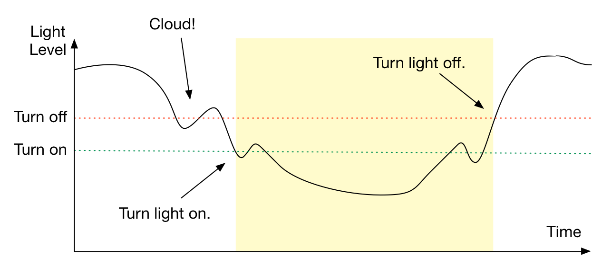

# Exploring Signals

The City of Oakland is embroiled in a power struggle: municipal electricity costs are sky-high! Mayor Jorry Brawn just read [a report about LED street lights](http://apps1.eere.energy.gov/buildings/publications/pdfs/ssl/oakland_demo_brief.pdf) that use 35% less energy than standard High Pressure Sodium bulbs, and he wants to replace all of Oakland's street lights with these new LED models. These new LED lights will save the city almost a million dollars a year on energy costs alone! At Joan Queen's house on Friday, you met Mayor Brawn and told him about this great Arduino workshop you just took and (the market for technical skills being what it is in the Bay Area these days) Mayor Brawn put you in charge of setting up [this new system](http://www2.oaklandnet.com/Government/o/PWA/o/IO/s/SL/).

Fortunately for you and the City of Oakland, this lab is here to help guide you!

1.  Start by connecting an LED *in series* with a resistor into pin 11. "In series" means that charge particles have to flow through the LED *and* the resistor. Start with this code that turns on the LED and reads the light level.
    <%= nonfunctional.ino =%>
2.  Add LDR in voltage divider to A0.

3.  Add Serial.println at the end of your `loop` function to see what light levels are recorded. Observe what happens when you cover the LDR. Experiment and choose a level (a **threshold**) that you think looks dark enough to need a street light.

4.  Add an `if` statement to your `loop` function, so that if the light level is **below** your chosen threshold, the LED is turned on, and otherwise, the LED is turned off. Your code might look like this:
    <%= basic-threshold.ino =%>
5.  Observe what happens when you cover the LDR. The light comes on! Yay. Call Jorry and tell him the good news. But wait -- what happens when the ambient light is *close* to the threshold? Around "dusk" you're likely to experience flicking of the light. That's less than ideal given that flickering lights can cause seizures! How can we fix this?

7.  There's a concept called *hysteresis* that we can use. Roughly speaking, we'll use a higher threshold value for switching the LED from **off** to **on** and a lower threshold value for switching the LED from **on** to **off**. 

    One way to think about what's going on is that we have an *analog input signal* we want to convert into an *digital output signal*. A signal is a value that varies over time. In our example, the light level is a signal. An analog signal is a signal whose value can vary within a given range, often analogous to a physical value. In our example, the light level is an analog signal: its value varies according to the ambient light in the room, in the range 0 to 1023.
    
    A digital signal is a signal whose value is one of a given set of values. Many digital signals consist of sequences of **high** and **low** values. In our example, whether the LED street light is on or off is a digital signal: it's either **on** or **off**.

    

    To do this, we'll need to keep track of whether we're the lamp is "on" or "off". Here's some code that does this:
    <%= hysteresis.ino =%>
8.  