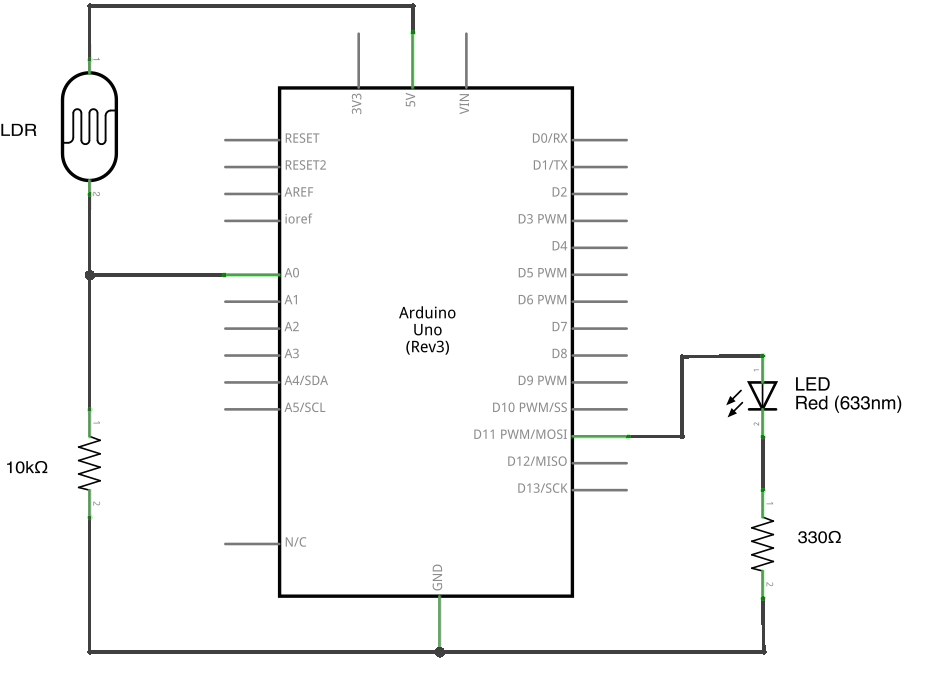
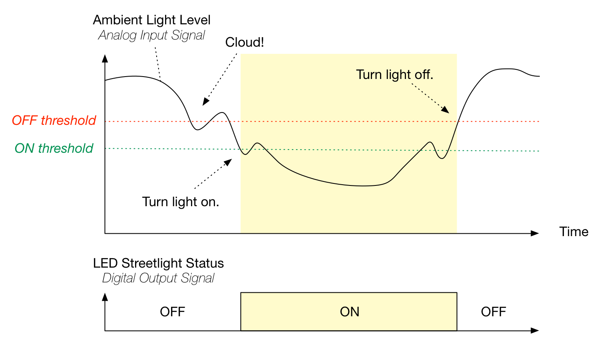
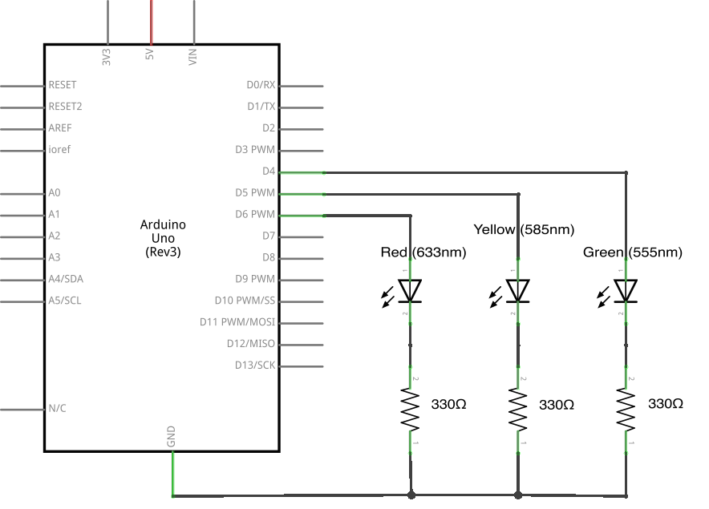
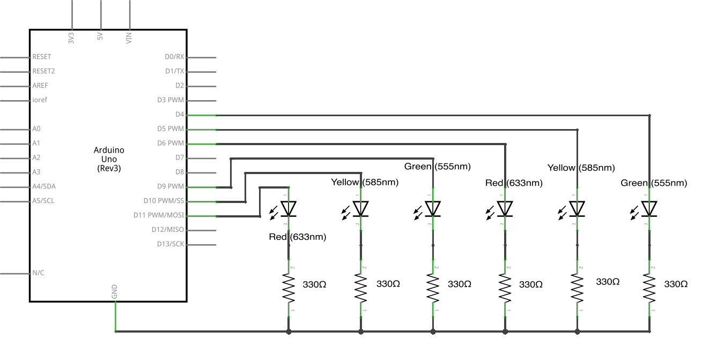
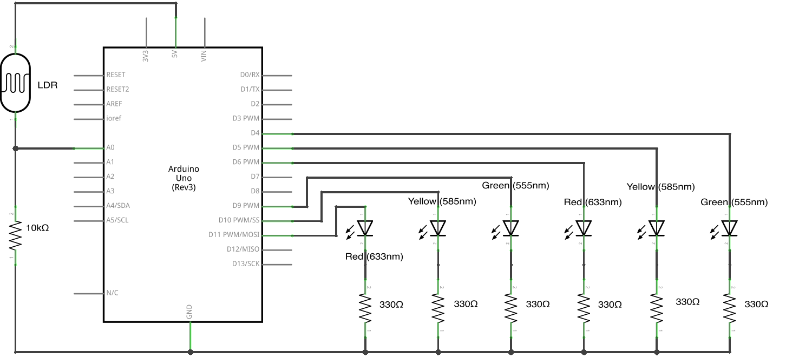

# Exploring Signals

The City of Oakland is embroiled in a power struggle: municipal electricity costs are sky-high! Mayor Jorry Brawn just read [a report about LED street lights](http://apps1.eere.energy.gov/buildings/publications/pdfs/ssl/oakland_demo_brief.pdf) that use 35% less energy than standard High Pressure Sodium bulbs, and he wants to replace all of Oakland's street lights with LED models. The LEDs will save the city almost a million dollars a year on energy costs alone! At Joan Queen's house party last night, you met Mayor Brawn and told him about this great Arduino workshop you just took and (since all the professional engineers are working for Tesla these days) Mayor Brawn put you in charge of setting up [this new system](http://www2.oaklandnet.com/Government/o/PWA/o/IO/s/SL/).

Fortunately for you (and the City of Oakland), this lab is here to help guide you.

1.  Start by connecting an LED *in series* with a 330Ω resistor into pin `11`. "In series" means that charge particles have to flow through the LED *and* the resistor. Then add an LDR (Light Dependent Resistor) in series with a 10kΩ resistor, and connect the pin between the LDR and the 10kΩ resistor to analog input pin `A0`. Your circuit might look like this:

     
    
    Learn more about [series and parallel circuits at SparkFun](https://learn.sparkfun.com/tutorials/series-and-parallel-circuits).
    
    The circuit with the LDR and resistor is known as a *voltage divider*. A "voltage divider" is a circuit that lets you measure a change in resistance in one resistor. The two resistors are *in series*, so all the charge particles that flow through one must flow through the other as well. 
    
    If the two resistors have the same resistance, then the charge particles lose half their "energy" in each resistor. If one resistance increases (and the other stays the same), then the charge particles will lose more energy in that resistor.
    
    We can measure that resistance change by measuring the energy of the charge particles after they've gone through that resistor but not the other -- by connecting the middle point between the two resistors to an analog input. That's what you see in the circuit above.
    
    Learn more about [voltage dividers at SparkFun](https://learn.sparkfun.com/tutorials/voltage-dividers).

2.  Start with this code that turns on the LED and reads the light level.
    <%= nonfunctional.ino =%>
    
3.  Add the function call to `Serial.println(lightLevel);` inside the `{}` of your `loop` function, before the final `}`, to see what light levels are recorded. (Also add `Serial.begin(9600);` inside the `{}` of your `setup` function.) Observe what happens when you cover the LDR. Experiment and choose a level (a **threshold**) that you think looks dark enough to need a street light.

4.  Add an `if` statement to your `loop` function, so that if the light level is **below** your chosen threshold, the LED is turned on, and otherwise, the LED is turned off. 

    Learn more about `if` statements in the [Arduino reference](http://arduino.cc/en/Reference/Else). 
    
    Your code might look like this:
    <%= basic-threshold.ino =%>
5.  Observe what happens when you cover the LDR. The light comes on! Yay. Call Jorry and tell him the good news. But wait -- what happens when the ambient light is *close* to the threshold? Around "dusk" you're likely to experience flicking of the light. That's less than ideal given that flickering lights can break LED driver circuits and can cause seizures!

6.  There's a concept called *hysteresis* that we can use to fix this problem. Roughly speaking, we'll use a higher threshold value for switching the LED from **off** to **on** and a lower threshold value for switching the LED from **on** to **off**. 

    One way to think about what's going on is that we have an *analog input signal* we want to convert into an *digital output signal*. A signal is a value that varies over time, and an *analog* signal is a signal whose value can vary within a given range, *analogous* to a physical value. In our example, the light level is an analog signal: its value varies according to the ambient light in the room, in the range 0 to 1023.
    
    A digital signal is a signal whose value is one of a given set of values. Many digital signals consist of sequences of **high** and **low** values. In our example, whether the LED street light is on or off is a digital signal: it's either **on** or **off**.

    

    To do this, you'll need to keep track of whether the lamp is "on" or "off". If the light is on, and you pass the "off" trigger, then turn off the light. If the light is off and you pass the "on" trigger, then turn on the light. But, crucially, if the light is on, the "on" trigger does nothing, and similarly if the light is off then the "off" trigger does nothing. Here's some code that does this:
    <%= hysteresis.ino =%>
7.  Send Mayor Brawn an invoice!

## Stopping Traffic

1.  Mayor Brawn is so impressed with your work that he's hired you for a follow-up project: replacing all the city's traffic signals. (Another type of signal! Is it digital or analog?)

    Oakland drivers have been complaining about having to wait at traffic lights even when there's no traffic. Mayor Brawn wants you to solve the problem by building traffic signals that switch from red to green when a car reaches them.
    
    Start by creating this model of a single traffic light:
    
         

2.  Write some code that starts from a green light, waits 10 seconds, shifts to yellow for [the appropriate amount of time for your street](http://www.hayward-ca.gov/CITY-GOVERNMENT/DEPARTMENTS/POLICE/RLCE/pdf/MUTCD_yellow_time_specs.pdf), then shifts to red for 30 seconds before switching starting over at green. Your code may end up looking something like this:
    <%= single-traffic-light.ino =%>
3.  With that done, add a second traffic light, to model a traffic intersection between one-way streets:

     

4.  Modify your code so that two seconds after one traffic light switches to red, the other switches to green. Make it look as natural as you can!

    Your code might look something like this:
    <%= two-traffic-lights.ino =%>
5.  Now that you've modeled a traffic intersection, it's time to make things complicated. Add an LDR voltage divider and connect it to pin `A0`:

     

6.  Pretend that the first signal is on a major busy street (say, Broadway), and that the second signal on a side street (say, Clay St.) should only be switched to green when a car is blocking light to the LDR. Use the analog input value you read from pin `A0` to trigger the signal switch.

    One solution might be to think of the "steady state" -- what pattern of lights is the "default" pattern of lights? That is, what do you display when there's no traffic at all?
    
    Then, think about how you'll know when a car comes down Clay St. When do you check? And once a car triggers the sensor, what do you do?
    
    Your code may end up looking like this:
    <%= simple-activated-light.ino =%>
7.  Send Mayor Brawn another invoice!

## Challenges:

*   Mayor Brawn wasn't as impressed this time around. In particular, he wants the side street light to only be green as long as there is traffic, not some arbitrary fixed amount of time!

    To solve this puzzle, you'll need to start tracking what state you're in, as in the street light example. Add a variable that tracks whether the thoroughfare light is green or whether the side street light is. If the side street light is green, check to make sure there's still traffic. If there's not, switch the lights and the state.

*   Oakland drivers are now complaining that traffic on side streets is completely backing up traffic on thoroughfares. Change your code so that side street lights are green for *at most* 10 seconds at a time, and thoroughfare lights are green for *at least* 10 seconds at a time.

    You will almost certainly need [the `millis` function](http://arduino.cc/en/Reference/millis) and a variable to keep track of how much time has passed since you switched the lights!
